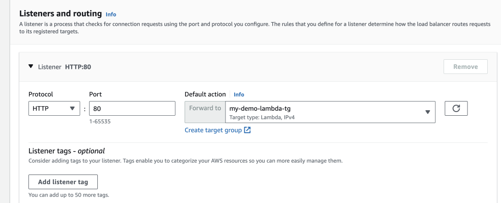

# AWS Lambda with AWS Application Load Balancer (ALB) Demonstration Node.js

This repository provides a demonstration of how to use AWS Lambda with an AWS Application Load Balancer (ALB). The included Lambda function responds with a simple "hello from lambda" message when triggered by the ALB.

## Lambda Function Code

Below is the code for the Lambda function used in this demonstration:

```javascript
console.log('Loading function');

exports.handler = async (event, context) => {
    
    // Log event
    console.log(event);
    
    // Create a response object
    const response =  {
        statusCode: 200,
        isBase64Encoded: false,
        headers:{
             "Content-Type" :  "text/html"
        },
        body: JSON.stringify({ success: 'hello from lambda' }),
    };
    
    return response ;
};
```

## How to Use

To use this demonstration, follow these steps:

1. **Create Lambda Function**: Create a new Lambda function in your AWS account and copy the code provided above as the function code.

2. **Create ALB**: Create a new AWS Application Load Balancer and configure it to forward requests to your Lambda function after adding it to a Target Group.
 
3. **Configure ALB**: Set up an AWS Application Load Balancer and configure it to forward requests to your Lambda function.


 
4. **Testing**: Access the ALB's URL in your web browser or using an HTTP client, and you should receive a response with "hello from lambda."

!(alb sucess)[imgs/hello.png]

5. **Logs**: You can view the logs for the Lambda function in CloudWatch.


## Additional Resources

For more information on AWS Lambda and AWS ALB, you can refer to the following resources:

- [Using AWS Lambda with an Application Load Balancer](https://docs.aws.amazon.com/lambda/latest/dg/services-alb.html)
 
Please note that you will need to assign a security group to the load balancer to allow HTTP traffic.